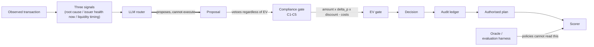

# retry-economist

**Demo video:** https://youtu.be/546K-NPIYxw

Failed-payment recovery agent that treats every retry as a purchase decision: an LLM proposes what to do about a failed payment, and an economist layer prices the proposal against expected value and five hard compliance rules before anything is authorised. Razorpay AI Buildathon, Track 03 (AI Revenue Recovery).

> **Recovered 45.4% vs 39.0% for naive retry, using 64% fewer retry attempts and one-sixth the cost per rupee recovered.**

That is `retry_economist (prior)` vs `naive_retry_3x` on the full 749-transaction holdout (`results/holdout_scoreboard.json`): 515 attempts vs 1,430 (64% fewer), and INR 0.02 spent per net rupee recovered vs INR 0.12 (one-sixth). The paired bootstrap over the same resampled customers supports the uplift: **+6.41pp [+3.25, +9.80]**, interval excludes zero.

## The framing

Of 749 held-out failed payments:

- **23.4%** would have paid unaided regardless of what anyone did (`do_nothing`'s own recovery rate - these customers are not a routing problem).
- **38.6%** were unrecoverable by any affordable action at all (100% − the 61.4% recoverable ceiling; see `oracle_best`'s bound).
- Only **38.1%** are actually *addressable* - not going to pay on their own, but recoverable by some action within the invoice's attempt cap (285 of 749; `results/holdout_scoreboard.md`, `do_nothing`'s attribution row).

`naive_retry_3x` acts on 93.7% of the holdout (702 of 749) regardless of which of these three buckets a transaction falls in - it cannot tell an organic payer, a hopeless case, and a genuinely addressable one apart. The entire point of everything downstream of that baseline is discriminating between them before spending anything.

## Results

### Full holdout (749 transactions, 240 customers) - no LLM, fully offline

| policy | recovery (95% CI) | net uplift pp (95% CI) | decision precision | decision recall | decision F1 |
| --- | ---: | ---: | ---: | ---: | ---: |
| `do_nothing` | 23.4% [20.4, 26.3] | +0.0 [+0.0, +0.0] | n/a | 0.0% | n/a |
| `naive_retry_3x` | 39.0% [34.9, 43.0] | +15.6 [+12.2, +18.9] | 20.8% | 96.7% | 34.2% |
| `rules_only` | 47.9% [44.1, 51.7] | +24.6 [+21.6, +27.7] | 31.0% | 83.6% | 45.2% |
| `retry_economist (prior)` | 45.4% [41.6, 49.1] | +22.0 [+19.2, +25.1] | 32.4% | 73.0% | 44.9% |
| `oracle_best` (CHEATS - reads the answers) | 61.4% [57.4, 65.4] | +38.1 [+34.7, +41.4] | 100.0% | 100.0% | 100.0% |

Paired bootstrap, same customers resampled both arms:

| comparison | net uplift pp delta (95% CI) | supported |
| --- | ---: | :---: |
| `rules_only` vs `naive_retry_3x` | +8.95 [+5.72, +12.50] | yes |
| `rules_only` vs `do_nothing` | +24.57 [+21.61, +27.74] | yes |
| `retry_economist (prior)` vs `rules_only` | −2.54 [−3.63, −1.52] | yes (economist recovers LESS) |
| `retry_economist (prior)` vs `naive_retry_3x` | +6.41 [+3.25, +9.80] | yes |

`retry_economist (prior)` recovers significantly *less* than `rules_only` (that interval excludes zero too, in the other direction) while spending 64% fewer attempts at one-sixth the cost - a real trade, not a free lunch, and its net-value ranking against `rules_only` flips depending on the assumed customer lifetime value (see "What this cannot do").

### SUBSAMPLE (47 of the 749 holdout transactions) - the LLM rows

**These numbers are not comparable to the table above - different n, different (skewed) transaction mix.** Phase 4's real-model run against `gemini-3.5-flash-lite` never finished the full holdout (~0.5 calls/minute on the free tier); these 47 are exactly the transactions with a real cached response reachable today with zero network calls. The subsample skews toward bank-downtime and hard-decline codes and away from insufficient-funds (see "What this cannot do") - no number below should be read as a full-holdout estimate.

| policy | recovery (95% CI) | net uplift pp (95% CI) | decision precision | decision recall | decision F1 |
| --- | ---: | ---: | ---: | ---: | ---: |
| `retry_economist (prior)` (subsample) | 44.7% [32.0, 57.1] | +21.3 [+10.4, +33.3] | 33.3% | 62.5% | 43.5% |
| `llm_router_only` (NO ECONOMIST) | 48.9% [36.2, 61.2] | +25.5 [+13.5, +38.6] | 35.3% | 75.0% | 48.0% |
| `retry_economist (LLM plan)` (full architecture) | 42.6% [30.4, 55.1] | +19.1 [+8.5, +30.4] | 34.6% | 56.2% | 42.9% |

Paired, same 41 customers resampled both arms - **all three straddle zero, reported as underpowered, not as wins or losses**:

| comparison | net uplift pp delta (95% CI) | supported |
| --- | ---: | :---: |
| `llm_router_only` vs `rules_only` (subsample) | −4.26 [−13.33, +4.17] | no |
| `retry_economist (LLM plan)` vs `llm_router_only` | −6.38 [−13.73, +0.00] | no |
| `retry_economist (LLM plan)` vs `retry_economist (prior)` (subsample) | −2.13 [−9.52, +4.55] | no |

The middle row is the one gap this project set out to close: `retry_economist (LLM plan)` is the LLM router's real proposal, priced and vetoed by the same economist as everywhere else. What did the economist add to the LLM? What did the LLM add to the economist? At n=47, the honest answer to both is "not enough data to tell" - the point of building this pairing was that it now exists and was measured, not that either comparison favours it here.

## What the economist does

`rules_only` and `naive_retry_3x` only propose plans; they have no notion of expected value or hard compliance limits. Pairing `naive_retry_3x`'s IDENTICAL, failure-code-blind three-attempt ladder with the economist isolates what the economist alone contributes (`results/veto_precision_naive_plan.md`):

| policy | `hard_decline_retry_waste` |
| --- | ---: |
| `naive_retry_3x` | **245** |
| `retry_economist (naive plan)` | **0** |

Same proposed ladder on every one of those transactions, both times - 245 debit attempts spent retrying instruments the acquirer had already flagged as blocked, closed, or fraud-declined (which no retry on any rail can ever clear) drop to zero, entirely attributable to two compliance rules (`C1_RISK_DECLINED`, `C2_HARD_DECLINE_NO_DEBIT`) that never override an expected-value calculation - they run *before* it and remove the action outright.

**Veto precision** - of everything the economist removed from that same pairing, what share would have failed anyway (so removing it cost nothing)?

| split | veto precision |
| --- | ---: |
| compliance-driven (`C1`/`C2`/`C4`) | **98.2%** |
| economics-driven (`EV<=0`) | **59.9%** |

The compliance rules are near-free: almost everything they block was never going to work anyway. The economics gate is where the real trade-off lives - **roughly 4 in 10 economically-vetoed actions would actually have recovered the payment.** That is the honest price of the caution behind the −2.54pp uplift gap against `rules_only` above.

## Architecture



`Proposal` and `Decision` are distinct types enforced structurally, not by convention: the simulator only accepts a `Decision`, `Decision` is never constructed inside the router package, and a test walks the router's syntax tree to keep it that way. The compliance gate runs *before* the EV gate and nothing downstream can override a rule that fires there, regardless of amount - a property test checks directly with a ₹10-crore transaction. The oracle holds every action's counterfactual outcome; no policy has a code path to it (an AST-based leakage guard asserts this), and only the scorer ever reads it, after a decision is already made.

## Audit trail

Every economist decision writes one append-only JSONL line to `results/audit_ledger.jsonl` (`src/retry_economist/audit/ledger.py`) - opened in append mode, never rewritten, checked by a test that a second run's bytes extend the first run's byte-for-byte. One record carries: `txn_id`, `decided_at`, `policy`, `estimator`, `provider`/model pin, all three signals with their confidences, the proposal (plan, rationale, and - when LLM-backed - the model's own self-reported root cause / confidence / probabilities), every compliance rule checked and which fired, the itemised EV terms (every line of the formula, not just the total), the verdict, the final authorised plan, a human-readable reason, and a `sha256(txn_id, action, attempt_index)` idempotency key per authorised action so a replay can never double-charge.

The same transaction, `pay_00861` (ACS_TIMEOUT / 3DS drop-off), priced two different ways - the model's own claim and the number that actually decided it:

```json
// retry_economist (LLM plan) - real gemini-3.5-flash-lite proposal
"proposal": { "plan": ["retry_now"], "p_recover_if_act": 0.65, ... }
"ev":       { "p_recover_if_act": 0.472973, "net_expected_value_paise": 7396.17, ... }
"verdict": "approve", "authorised_plan": ["retry_now"]
```

The model's own estimate (**0.65**) and the train-only historical prior's priced estimate for that same action (**0.47**) disagree by 18 points. **The prior's number is the one that decided** - Phase 4 found the model's self-reported probabilities lose to this prior on both `p_recover_if_act` and `p_recover_if_abstain`, which is exactly why the economist prices with the prior and never reads the model's own confidence. Full lines for both `retry_economist (prior)` and `retry_economist (LLM plan)` on this transaction are in `results/audit_ledger.jsonl` and reproduced in `docs/PROGRESS.md`, Phase 6.

## How to reproduce

Everything below replays **offline, with no API key** - the LLM cache (`data/llm_cache/`) is committed, and every step reads it rather than the network.

```
pip install -e .
python -m retry_economist.generator.cli --seed 42 --n 2500 --customers 900

# Full-holdout scoreboard (no LLM):
python -m retry_economist.eval.cli --split holdout \
    --policies "do_nothing,naive_retry_3x,rules_only,retry_economist (prior),oracle_best"

# CLV / discount-rate sensitivity sweeps:
python -m retry_economist.eval.cli --split holdout \
    --policies "do_nothing,naive_retry_3x,rules_only,retry_economist (prior),oracle_best" \
    --clv-sweep --discount-sweep

# Phase 4 + 5: real-model subsample scoreboard (n=47), fully offline:
python scripts/subsample_scoreboard.py

# Phase 6: append-only audit ledger, off by default:
python -m retry_economist.eval.cli --split holdout --policies "retry_economist (prior)" --audit
python scripts/subsample_scoreboard.py --audit

# Two-minute offline demo (everything above, condensed):
python scripts/demo.py

# Full test suite:
python -m pytest tests -q
```

## What this cannot do

This is a scored simulation, not a production system, and not every gap here is a "future work" item - some are permanent properties of the approach.

- **Synthetic data, not real transactions.** Every number above comes from a generated dataset (`generator/`) with a deterministic seed, not live payment traffic. The generator's assumptions about failure-mode mix, issuer behaviour, and customer liquidity patterns are the ceiling on how far these numbers transfer.
- **The LLM measurement covers 47 of 749 transactions (6.3%)** and is skewed toward bank-downtime and hard-decline codes (+10.4pp and +7.3pp over their full-holdout share) and away from insufficient-funds (−18.3pp) - it is exactly the chronological first ~97 holdout transactions a rate-limited background run reached before it stopped, not a random draw. Every router-vs-rules or router-vs-economist comparison in this project is **directional only**, not a full-holdout result, and every paired CI at this n straddles zero.
- **No execution against a live payment API.** There is no HTTP client anywhere in this codebase and none is planned. Phase 6 gives a decision an audit trail; it does not give it a way to spend money. Wiring an authorised plan to a real gateway call is explicitly out of scope.
- **Customer lifetime value and the daily discount rate are assumptions, not measurements**, and conclusions built on them are not free of that assumption. Concretely: `retry_economist (prior)`'s net-value ranking against `rules_only` **flips between CLV 4,000 and 12,000** - `rules_only` wins on raw net value at the low end (INR 704,596 vs 699,601), the economist's lower spend wins at the default and above (INR 688,983 vs 684,974 at 12,000). The "trade recovery for spend efficiency" conclusion is CLV-dependent and must not be stated without naming the assumption.
- **Economics-driven vetoes are only 59.9% precise** - roughly 4 in 10 actions the economist declines on expected-value grounds would, per the oracle, actually have recovered the payment. This system knowingly leaves real recoveries on the table in exchange for not spending on the other 6 in 10.
- **The historical prior is per-failure-code, with no within-code resolution.** `HistoricalPriorEstimator` predicts the same probability for every transaction sharing a `(failure_code, action)` pair, regardless of amount, issuer, customer tenure, or anything else - it is a lookup table, not a per-transaction model, and it is what the economist prices with precisely because the LLM's own per-transaction estimate did not beat it (see "Honest findings").
- **Single-decision episodes, not full sequential dunning.** Every transaction gets one plan, decided once, executed in order until something recovers or the plan runs out - there is no re-pricing mid-sequence if new information arrives (a customer's next unrelated failure, a changed issuer-health reading) the way a real multi-week dunning campaign would see.
- **The oracle's common-random-numbers assumption.** All 9 possible actions' outcomes for a given transaction share one uniform draw, so `oracle_best`'s ceiling measures "the best action available", not "the luckiest draw" - a deliberate design choice for a fair reference bound, but it also means the 9 actions' outcomes are more correlated than 9 independent real-world attempts would be.

## Honest findings

Stated plainly because they are the actual result, not because they are comfortable:

- **The model's probability estimates did not beat a train-only per-code prior.** `p_recover_if_act`: router Brier **0.2780** vs the historical prior's **0.2449** (n=34) - the prior wins. This comparison is itself underpowered (34 scored transactions); it is a real result on the data available, not a large-sample verdict.
- **`root_cause_confidence` was constant at 0.95 across all 47 real proposals** - zero variation despite genuinely different failure codes (hard declines, risk flags, bank downtime, insufficient funds all included). This signal is **uninformative** on this data and should not be weighted by anything downstream until shown otherwise at scale.
- **The model never once proposed `nudge_then_retry`** across all 47 transactions, despite `rules_only` using it twice and it being a legal, low-cost action in the allowed set.
- **`C1`/`C2` never fired against the real model's proposals** - not because the prompt forbids debit retries on hard/risk declines (it does not, unlike `rules_only`'s hardcoded logic), but because the model **independently declined to retry every one of the 9 hard-or-risk-decline transactions** in the subsample on its own reasoning (8 proposed nothing, 1 proposed only the compliance-exempt `request_new_mandate`). That is a good sign about this specific model's behaviour on this specific sample - and it changes nothing about why the rule exists: a hard rule that happens not to fire this time is not evidence it is safe to remove.

See `docs/PROGRESS.md` for the full build log, every intermediate result, and exactly how each number above was produced.
